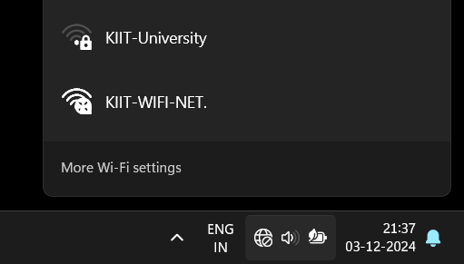

# Script for Fixing wifi issue for KP-1

This project automates connecting to a KIIT WiFi network and handles login using a PowerShell script. The script performs a sequence of actions, including pressing key combinations, navigating through fields, and submitting credentials.

## Why ??

Tired of having this show up




## Features

- Automates keyboard actions like pressing `Win+A`, `Tab`, and `Enter`.
- Automates input of username and password.
- Manages WiFi profiles (`delete`, `add`, `connect`) using `netsh` commands.
- Easily executable through a desktop shortcut.

## Requirements

- Windows OS
- PowerShell
- Administrative privileges (for certain network operations)

## Usage

1. **Setup the Script(For KP-1 Hostel):**
   - Check if you are connected to the kiit wifi(if not please do so).
   - Paste the following command in your powershell terminal ```netsh wlan export profile name="KIIT-WIFI-NET." folder="C:\Users\Paritosh Dot\Documents\KIIT_WIFI_ISSUE\Hostel" key=clear```
   - Please change the folder location to as per your wish as i have here create a folder named KIIT_WIFI_ISSUE then create a new folder(Hostel) in it to store the XML file. 
   - Then create a new powershell file here i have named it `Hostel.ps1` and paste the code that i have in my script of the same name.
   - In this Script change `netsh wlan add profile filename="C:\Users\Paritosh Dot\Documents\KIIT_WIFI_ISSUE\Hostel\Wi-Fi-KIIT-WIFI-NET..xml"` to your filename and location.
   - Don't forget to change the Username and Password line of line 57 & 61 repectfully. 
`

2. **Create a Shortcut(For KP-1 Hostel):**
   - Right-click and create a new shortcut.
   - Set the target to:
     ```cmd
     powershell -ExecutionPolicy Bypass -File "C:\Users\Paritosh Dot\Documents\KIIT_WIFI_ISSUE\WifiScript\Hostel.ps1"
     ```
   - Replace `C:\Users\Paritosh Dot\Documents\KIIT_WIFI_ISSUE\WifiScript\Hostel.ps1` with the script's path.

3. **Run the Script:(For KP-1 Hostel)**
   - Double-click the shortcut to execute the script.

4. **Optional: Change Shortcut Icon:**
   - Right-click the shortcut → **Properties** → **Change Icon**.

5. **Setup the Script(For College/Library/Labs ):**
   - Don't worry you just need to make only one more file just repeat the above process but this time go to College/Library/Labs.
   - And manually do the forget password like you usually do to connect the network and repeat steps 1 to 3.
   - Congratulations !!! now you don't need to manually forget password and reconnect to the network you can now double click the icon once and get instantly connected to the network.

## Note:
**According to me this is happening because both the network have different authentication KP-1 has a WPA connection and central Library has WPA2 Connection**

**Note this will only work if you have this error(if you want a normal forget->connect then remove the newly added lines 51 to 59)**

Please contribute to this Repo as it can solve  of our problem with KIIT wifi.