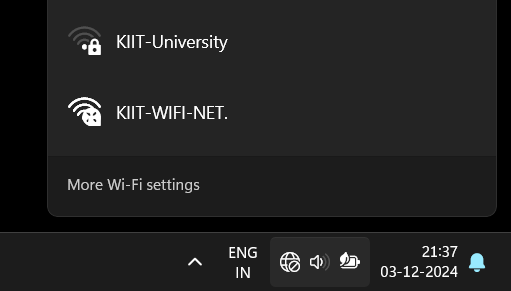

# Script for Fixing wifi issue for KP-1

This project automates connecting to a KIIT WiFi network, including the 802.1X (PEAP/MSCHAPv2) login, using a PowerShell script.

## Why ??

Tired of having this show up



## How it works

These networks use PEAP with an inner MSCHAPv2 login (`useOneX=true` in the
exported profile XML). Windows only shows that interactive "Windows Security"
sign-in box when it has no cached credential for the profile — right after
the profile is re-added, or after your KIIT password changes. Instead of
racing that popup with fake keystrokes, the script pushes your credential
into the profile programmatically via the Windows `WlanSetProfileEapXmlUserData`
API (see `WifiScript/Common.ps1`) before connecting, so the popup never
appears in the first place.

## Features

- Manages WiFi profiles (`delete`, `add`, `connect`) using `netsh` commands.
- Prompts once for your KIIT username/password and caches them encrypted
  (via Windows DPAPI, through `Export-Clixml`) at
  `%LOCALAPPDATA%\KiitWifi\credential.xml` — never stored in the repo or in
  plaintext.
- Easily executable through a desktop shortcut.

## Requirements

- Windows OS
- PowerShell

## Usage

1. **Setup the Script (for KP-1 Hostel):**
   - Check if you are connected to the KIIT wifi (if not, please do so).
   - Paste the following command in your PowerShell terminal:
     ```
     netsh wlan export profile name="KIIT-WIFI-NET." folder="C:\path\to\KIIT_WIFI_ISSUE\Hostel" key=clear
     ```
   - Change the folder location to wherever you keep this repo.
   - Copy `WifiScript/Common.ps1` and `WifiScript/Hostel.ps1` alongside your
     copy of the repo (or just use the ones already here).
   - In `Hostel.ps1`, change the `netsh wlan add profile filename=...` path
     to point at your exported XML file if your folder layout differs.
   - You do **not** need to hardcode a username/password anywhere — the
     first time you run the script it will prompt you for your KIIT
     credentials once via a normal Windows credential dialog.

2. **Create a Shortcut (for KP-1 Hostel):**
   - Right-click and create a new shortcut.
   - Set the target to:
     ```cmd
     powershell -ExecutionPolicy Bypass -File "C:\path\to\KIIT_WIFI_ISSUE\WifiScript\Hostel.ps1"
     ```
   - Replace the path with wherever your copy of `Hostel.ps1` lives.

3. **Run the Script (for KP-1 Hostel):**
   - Double-click the shortcut to execute the script.
   - On first run you'll be prompted once for your KIIT username/password.

4. **Optional: Change Shortcut Icon:**
   - Right-click the shortcut → **Properties** → **Change Icon**.

5. **Setup the Script (for College/Library/Labs):**
   - Repeat the above process using `Campus-25.ps1` or `Library.ps1` and the
     matching exported profile for that network.

6. **After a KIIT password reset:**
   - Run `WifiScript/Reset-Credential.ps1` once — it clears the cached
     credential and prompts you for the new one. Then just run your usual
     connect script as normal.

## Note

Earlier versions of this repo automated the popup with simulated keystrokes
and had a hardcoded username/password committed in plaintext in the scripts.
That approach was removed because it was fragile (broke on Windows UI
updates) and insecure (leaked credentials into git history). If you forked
this before this change and had your own credentials committed, rotate your
KIIT password.

Please contribute to this repo — it can solve a lot of people's problems with KIIT wifi.